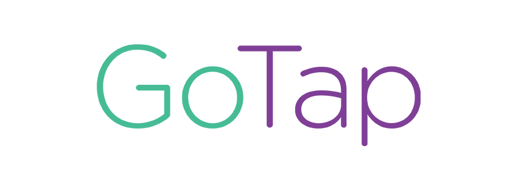

# GoTap
A search engine built from scratch using Google PageRank, integrate with Twitter and Instagram search

(1) Install Google-API-Python-Client

pip install --upgrade google-api-python-client

(2) Install Beaker Framework

pip install --upgrade setuptools
wget https://pypi.python.org/packages/source/B/Beaker/Beaker-1.6.4.tar.gz
tar xvfz Beaker-1.6.4.tar.gz
cd Beaker-1.6.4
python setup.py build
python setup.py install

(3) Install Bottle Framework

easy_install -U bottle

(4) Install APIs

pip install TwitterAPI
pip install python-instagram
pip install python-forecastio

(5) Change all App/Client ID and secret
